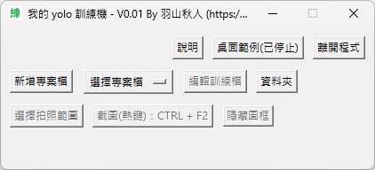
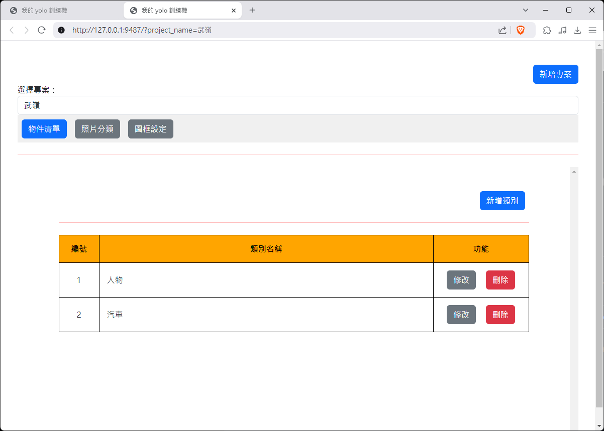
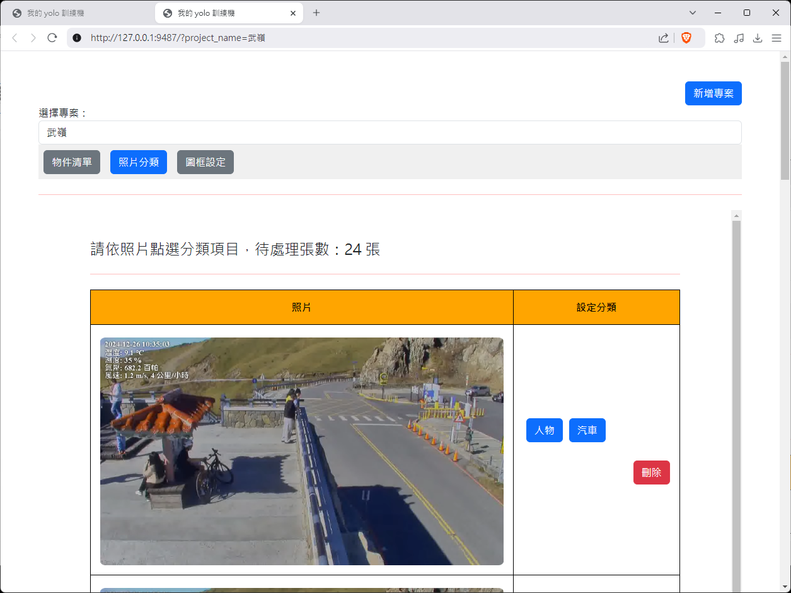
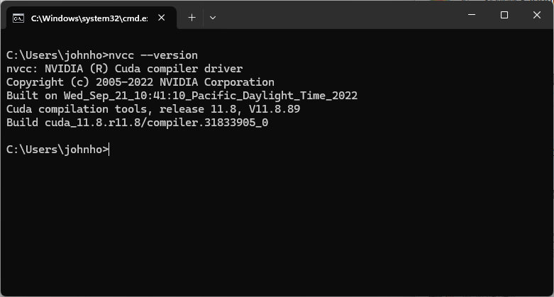
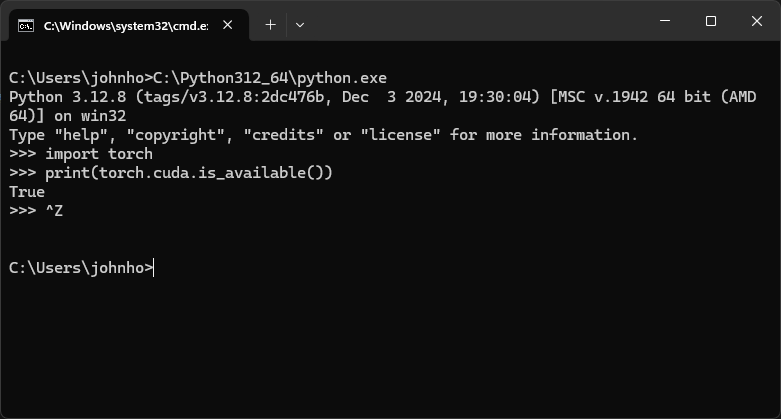

# my_yolo_train_tool
我的 yolo 訓練機，可以用 yolo 的範例直接在 windows desktop 看著畫面測試、訓練模型
建立模型專案、要訓練的種類，收集圖片、標記、訓練、測試、部署，一條龍服務

## my_vrm_mascot / Alicia Motion Studio

本專案同時包含 `my_vrm_mascot`，目前已從 VRM 吉祥物展示頁擴充成 Alicia Motion Studio：

- Agent Runtime：tool trace、self-healing、PolicyGate、Suggested Actions、ActingBridge。
- Character Runtime：Natural Pose、Idle Micro Motion、Short Motion Clips、Expression Layer。
- Motion Mining：`motion_template_lab.html` 可載入 VRMA、人工描述動作、產出 semantic motion 資料。
- 已收集 VRMA 樣本：172 支。
- 已人工描述 motion profile：172 筆。
- 已累積 mining log：173 筆。
- 已產出 semantic motion 種子：10 組，包括 `come_here`、`point_target`、`cross_no`、`thinking_chin`、`wave_goodbye` 等。

快速啟動：

```bat
cd my_vrm_mascot
run_server.bat
```

入口：

```text
http://127.0.0.1:8765/
http://127.0.0.1:8765/motion_template_lab.html
```

VRMA 樣本來源與授權狀態記錄在：

```text
my_vrm_mascot/examples/m6_7_vrma_samples/SOURCES.md
```

## 畫面截圖

單機執行畫面


標記畫面，桌面直接畫 Canvas 框


類型設定，設定要訓練的種類


圖片分類，將圖片分類到種類

## 環境安裝
1. 安裝 python3	
https://www.python.org/ftp/python/3.12.8/python-3.12.8-amd64.exe
建議安裝在 C:\Python312_64

2. 安裝 CUDA Toolkit 11.8
https://developer.nvidia.com/cuda-11-8-0-download-archive?target_os=Windows&target_arch=x86_64&target_version=11&target_type=exe_local
Windows→x86_64→11→exe (local)

裝完 cuda 後，記得檢查 cuda 版本，需確定是 11.8
```
nvcc --version
```

3. 安裝 requirements.txt
```
C:\Python312_64\Scripts\pip.exe install -r requirements.txt
```

4. 裝完 cuda 才能安裝 torch torchvision torchaudio 
```
C:\Python312_64\Scripts\pip.exe install torch torchvision torchaudio --index-url https://download.pytorch.org/whl/cu118
```

裝完 torch 記得檢查 cuda 有沒有運作

```
# C:\Python312_64\python.exe

import torch
print(torch.cuda.is_available())
# 看到 True 就是有運作
```

5. 安裝 ultralytics
```
C:\Python312_64\Scripts\pip.exe install ultralytics
```

6. 啟動

執行 run.bat 即可


